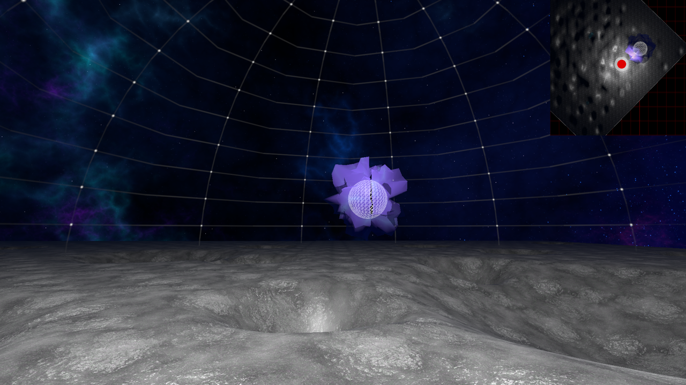

# 프로젝트 브리프
<table>
  <tr>
    <td>프로젝트명</td>
    <td>WUNDERKAMMER</td>
  </tr>
  <tr>
    <td>기간</td>
    <td>2023.05.02 ~ 2023.10.18</td>
  </tr>
  <tr>
    <td>목표</td>
    <td>경기필하모닉 마스터피스 시리즈 IX <라흐마니노프 교향곡 2번>을 홍보하는 메타버스 콘텐츠 전시</td>
  </tr>
  <tr>  
    <td>매체</td>
    <td>PC</td>
  </tr>
</table>

# 프로젝트 진행과정
<table>
  <tr>
    <th>활동</td>
    <th>기간</th>
    <th>참여자(본인역할)</th>
    <th>활동사진</th>
  
  </tr>
  <tr>
    <td>기획</td>
    <td>23.05.02 ~ 23.06.20</td>
    <td>6인팀(유니티 공간 디자인)</td>
    <td></td>
  </tr>

  <tr>
    <td>개발</td>
    <td>23.06.21 ~ 23.10.11</td>
    <td>2인팀(유니티 개발)</td>
    <td></td>
  </tr>

  <tr>
    <td>전시</td>
    <td>23.10.17 ~ 23.10.18</td>
    <td>2인팀(전시 상주)</td>
    <td></td>
  </tr>
</table>

# 기획

프로토타입과 사용자 반응을 빠르게 확인할 수 있는 스프린트 방식으로 다음과 같이 진행

<table>
  <tr>
    <td>장기목표</td>
    <td>바라만보던 문화예술을 직접 체험할 수 있는 경험을 제공한다.</td>
  </tr>
  <tr>  
    <td>목표</td>
    <td>경기필하모닉 마스터피스 시리즈 IX <라흐마니노프 교향곡 2번>을 홍보하는 메타버스 콘텐츠 전시</td>
  </tr>
  <tr>  
    <td rowspan="2">타깃</td>
    <td>문화예술 관람이 취미인 사람</td>
  </tr>
  <tr>  
    <td>졸업전시 홍보 사이트/SNS 방문자</td>
  </tr>
  <tr>  
    <td rowspan="2">기대효과</td>
    <td>1) 직접 체험하게 함으로써 방문자의 기억에 오래 남게 만든다.</td>
  </tr>
  <tr>  
    <td>2) 오케스트라에 대한 방문자의 인식에 변화를 준다.</td>
  </tr>
</table>

# 콘텐츠
달 표면을 돌아다니면서 교향곡을 구성하는 악기들을 수집하여 하나의 음악으로 완성하는 체험
> 악기 수집 과정에서 각각의 소리를 들으면서 완성되었을 때 오케스트라의 하모니를 기대하게 만듬

콘텐츠 진행 흐름

<table>
  <tr>
    <td>1</td>
    <td>가이드 확인</td>
    <td></td>
    <td></td>
  </tr>
  <tr>
    <td>2</td>
    <td>악기 탐색</td>
    <td></td>
    <td></td>
  </tr>
  <tr>  
    <td>3</td>
    <td>악기 수집</td>
    <td></td>
    <td></td>
  </tr>
  <tr>  
    <td>4</td>
    <td>음악 완성</td>
    <td></td>
    <td></td>
  </tr>
  <tr>  
    <td>5</td>
    <td>게임 종료</td>
    <td></td>
  </tr>
</table>

# 개발

## 1. 가이드 확인
<table>
  <tr>
    <td>가이드 창 표시, 다음/이전 가이드 표시 버튼, 창 닫기 버튼</td>
  </tr>
</table>

가이드 창 표시
> 첫 화면에서 아래에서 위로 가이드 창이 표시. 이때 게임 내 시간은 멈쳐 있음

다음/이전 가이드 표시 버튼
> 다음/이전 버튼을 누르면 해당하는 가이드 창이 표시

창 닫기 버튼
> 창 닫기 버튼을 누르면 가이드 창이 사라지고 게임 내 시간이 흐름

## 2. 악기 탐색
<table>
  <tr>
    <td>플레이어 조작(이동, 점프), 시점 전환, 미니맵</td>
  </tr>
</table>

플레이어 조작(이동, 점프)
> 키보드의 W/S/A/D를 통해 이동하고, 스페이스 바를 누르면 점프

시점 전환
> 오른쪽 마우스 버튼을 드래그하여 시점 전환

> 미니맵에서도 드래그한 시점에 맞게 회전

미니맵
> 플레이어의 위치와 수집해야 하는 악기의 위치를 표시

> 악기를 수집하면 미니맵에서 해당 악기의 아이콘은 표시되지 않음

## 3. 악기 수집
<table>
  <tr>
    <td>충돌 이벤트, 인벤토리</td>
  </tr>
</table>

충돌 이벤트
> 운석 구덩이 안에 있는 보이지 않는 오브젝트와 충돌하면 악기 수집

> 충돌했을 시 인벤토리 창이 열리면서 해당 악기의 소리가 재생

인벤토리
> 닫기 버튼을 클릭하면 인벤토리 창이 닫힘

> 모든(네 개의) 악기를 수집하면 완성된 음악의 이름과 이동해야 하는 장소를 안내하는 창이 표시

## 4. 음악 완성
<table>
  <tr>
    <td>충돌 이벤트</td>
  </tr>
</table>

충돌 이벤트
> 특정 장소로 이동하면 완성된 음악이 재생되고 보라색 파장도 함께 생김

> 그 장소에서 일정 거리를 벗어나면 음악이 재생되지 않고 다시 들어가면 처음부터 음악이 재생

## 5. 게임 종료
<table>
  <tr>
    <td>게임 종료</td>
  </tr>
</table>

게임 종료
> ESC 키를 누르면 계속하기, 다시하기, 게임종료를 선택할 수 있는 옵션 창이 표시

# 전시
